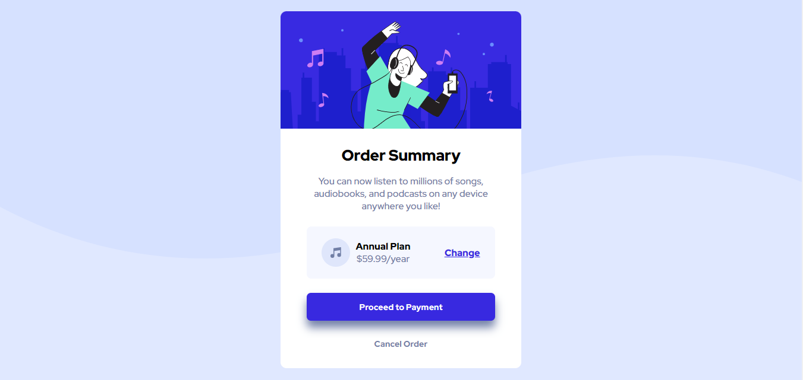

# Frontend Mentor - Order summary card solution

This is a solution to the [Order summary card challenge on Frontend Mentor](https://www.frontendmentor.io/challenges/order-summary-component-QlPmajDUj). Frontend Mentor challenges help you improve your coding skills by building realistic projects. 

## Table of contents

- [Overview](#overview)
  - [The challenge](#the-challenge)
  - [Screenshot](#screenshot)
  - [Links](#links)
- [My process](#my-process)
  - [Built with](#built-with)
  - [What I learned](#what-i-learned)
  - [Continued development](#continued-development)
  - [Useful resources](#useful-resources)
- [Author](#author)

## Overview

### The challenge

Users should be able to:

- See hover states for interactive elements

### Screenshot



### Links

- Solution URL: [Github Repository](https://your-solution-url.com)
- Live Site URL: [Github Pages](https://your-live-site-url.com)

## My process

### Built with

- Semantic HTML5 markup
- SASS
- Flexbox

### What I learned

During this project, I have tried using a CSS preprocessor. My choice was to use SASS, because it is the most popular and simplest to use. I have learned how to make and use variables for my color palette in SASS. An example is down below: 

```scss
  /* Declaring variables */
  $pale_blue: hsl(225, 100%, 94%);
  $bright_blue: hsl(245, 75%, 52%);

  /* using variables */
  body {
    background-color: $pale_blue;
  }
```

I have also learned about the nesting of CSS selectors, which isn't possible in regular CSS. An example below: 
```scss
  .main-hero-container {
    img {
        border-radius: 10px 10px 0 0;
    }

    p {
        color: $desaturated_blue;
        margin: 1em 3.5em 1.5em;
    }
}
```

### Continued development
 
For my future web development projects, I would really like to learn more about SASS mixins. I have got the basics down of SASS and would like to learn alot more about some more advanced concepts and when to use those.

### Useful resources

- [CSS Tricks - Flexbox Guide](https://css-tricks.com/snippets/css/a-guide-to-flexbox/) - This website has helped me alot to understand how CSS Flexbox actually works. It also contains a handy visual cheatsheet that you can reference when you are stuck with CSS.

## Author

- Frontend Mentor - [@your1405](https://www.frontendmentor.io/profile/your1405)
- Twitter - [@Your1405Gaming](https://www.twitter.com/Your1405Gaming)
